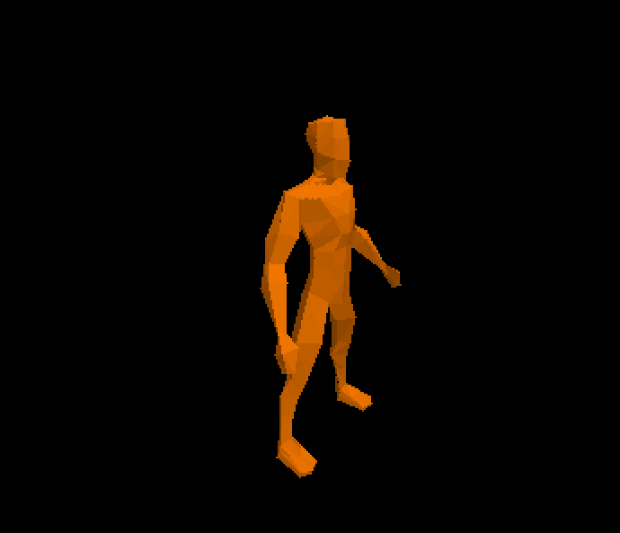

# mzAPO 3d graphics development toolkit

NEON-accelerated 3D triangle rasterizer



> Triangles are NOT rendered with a traditional scanline rasterization. A plane-equation based approach similar to GPUs is used instead, where the entire screen-space bounding box is iterated and tested. This is much easier to vectorize.


## Features
- simple flat-shaded diffuse shading to colorize the triangles in a nice way
- backface culling using screen-space area computation
- models are embedded as C float arrays, generated from obj files with a script
- tiled depth buffer

The renderer is mostly limited by pixel fill rate, like CPU rasterizers tend to be.

## Building

### C code
```
clang demo.c
```

### Shaders
> Note: you don't need to compile shaders unless you want to change them. The precompiled shaders already are in `shaders.h`
The desktop sokol-based backend uses a single tiny GPU shader to display
our CPU-rendered texture to the screen.

The shader is compiled using `sokol-shdc` from [sokol-tools](https://github.com/floooh/sokol-tools-bin).

Clone the repo and use the following command (with the correct `sokol-shdc` path depending on your platform):
```
sokol-tools-bin\bin\win32\sokol-shdc.exe --input shaders.glsl --output shaders.h --slang glsl430
```

## Credits
- https://fgiesen.wordpress.com/2013/02/17/optimizing-sw-occlusion-culling-index/
